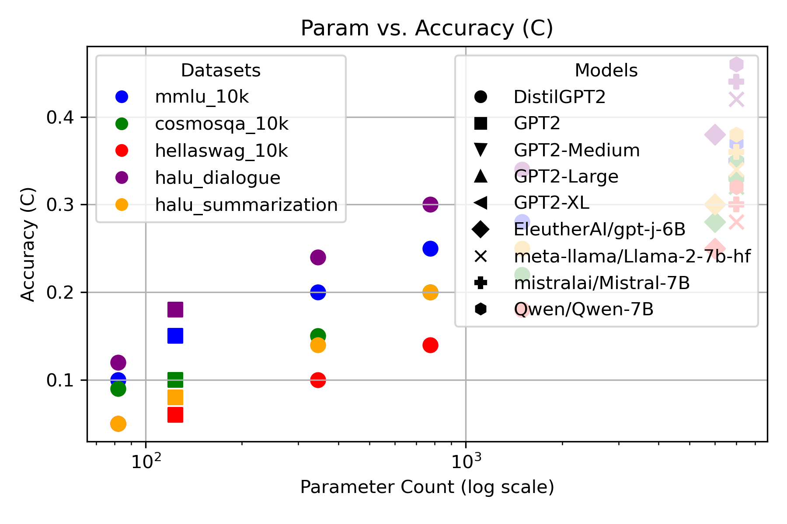
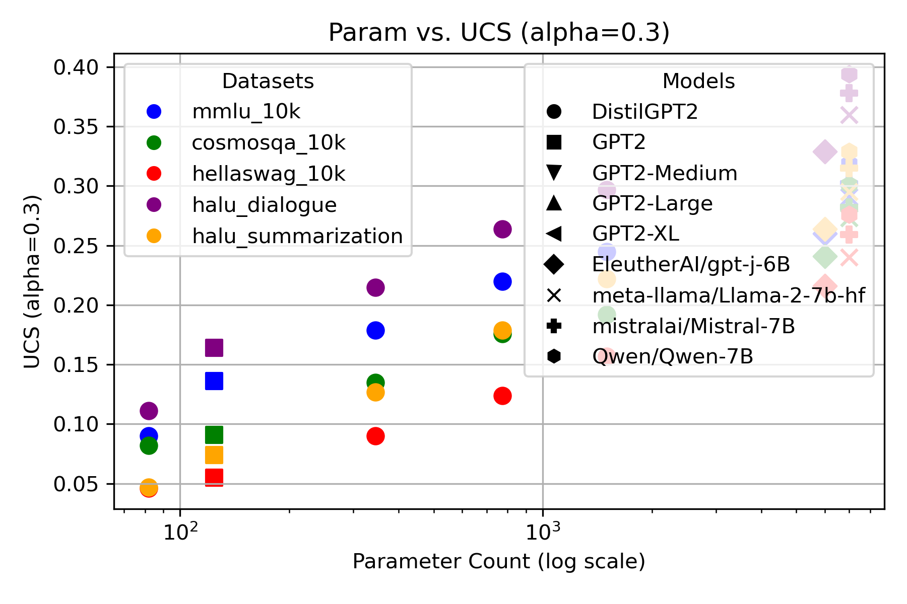
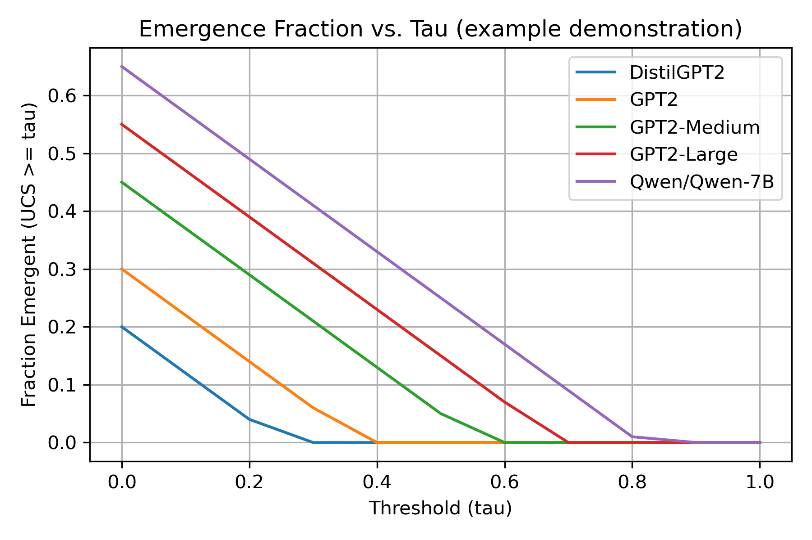

# **EmergentCapabilities: Uncertainty-Aware Capability Manifolds in LLMs**

A research codebase accompanying our paper:

> **“Uncertainty-Aware ε-Capability Manifolds for Predicting Emergent Behaviors in Large Language Models.”**  
> *Shubham Chakraborty*, *Anupam Srivastava*  
> **Conference**: *Under Review for ICML 2025*

---

## **Abstract**

Large Language Models (LLMs) can exhibit *emergent capabilities*—unexpected jumps in performance or new skills—once they exceed certain parameter scales. This repository offers both a **theoretical** and **practical** framework to **measure**, **predict**, and **visualize** these emergent phenomena. Our approach combines:

1. **ε-Capability Manifolds**: A geometry‐centric perspective of capability boundaries within parameter space.  
2. **Uncertainty-Aware Capability Score (UCS)**: Merging performance with uncertainty estimates to see *when* a capability is not only present but also **reliable**.

The code includes:
- Pipelines for **multiple-choice tasks** (QA, reading comprehension, etc.).  
- Uncertainty quantification via **entropy** or optional conformal methods.  
- Ablation scripts for **\(\alpha\) sweeps** in UCS and **\(\tau\) thresholds** for emergent detection.  
- Comprehensive example runs from **DistilGPT2** (~82M params) up to **7B** parameter models (Mistral, Qwen, Llama-2, GPT-J).

---

## **Table of Contents**

1. [Features](#features)  
2. [Project Structure](#project-structure)  
3. [Installation & Setup](#installation--setup)  
4. [Usage](#usage)  
   - [Data Preparation](#data-preparation)  
   - [Running Experiments](#running-experiments)  
   - [Analysis & Plots](#analysis--plots)  
5. [Key Results & Figures](#key-results--figures)  
6. [Ablations & Sensitivity](#ablations--sensitivity)  
7. [Citation](#citation)  
8. [License](#license)  

---

## **1. Features**

- **ε-Capability Manifolds**: Formalize emergent capability boundaries in parameter space.  
- **Uncertainty-Aware Capability Score (UCS)**: Incorporates model *uncertainty* to identify robustly emergent skills.  
- **Multiple Datasets**: Examples for QA (mmlu_10k), reading comprehension (cosmosqa_10k), commonsense inference (hellaswag_10k), dialogue response selection (halu_dialogue), and summarization (halu_summarization).  
- **Visualizations**: 
  - Param vs. Accuracy, Param vs. UCS (with legends)  
  - Grouped bar charts per dataset (Accuracy vs. UCS)  
  - Emergence threshold plots (\(\tau\) sweeps)  

---

## **2. Project Structure**

An example directory layout:

```
emergence_project/
├── data/
│   ├── mmlu_10k.json
│   ├── cosmosqa_10k.json
│   ├── hellaswag_10k.json
│   ├── halu_dialogue.json
│   ├── halu_summarization.json
│   └── ...
├── results/
│   ├── figures/
│   │   ├── param_vs_acc_legend.png
│   │   ├── param_vs_ucs_legend.png
│   │   ├── bar_chart_all_datasets.png
│   │   ├── emergence_fraction_vs_tau.png
│   │   └── ...
│   ├── cosmosqa_results_distilgpt2.json
│   ├── ...
├── src/
│   ├── main.py               # Example multi-choice pipeline
│   ├── model_utils.py        # HuggingFace model loading
│   ├── multiple_choice.py    # Probability extraction logic
│   ├── capability_utils.py   # Functions for capability, uncertainty
│   └── ...
├── analysis.ipynb            # Interactive notebook for analysis
├── summary_plot.py           # e.g. code for param vs. acc/ucs
├── final_plot_table.py       # e.g. script that merges everything
├── emergence_threshold_plot.py
├── bar_chart_all_datasets.py
├── requirements.txt
├── README.md                 # You're here
└── LICENSE
```

---

## **3. Installation & Setup**

**Requirements**:
- Python 3.9+
- [Anaconda / Miniconda](https://docs.conda.io/en/latest/) recommended
- An NVIDIA GPU with CUDA 11.8 for larger models

**Steps**:

1. **Clone** the repo:
   ```bash
   git clone https://github.com/enigma-kun/EmergentCapabilities-Uncertainty-Aware-Capability-Manifolds-in-LLMs.git
   cd EmergentCapabilities-Uncertainty-Aware-Capability-Manifolds-in-LLMs
   ```
2. **Create & activate** a conda environment:
   ```bash
   conda create -n emergence_env python=3.9 -y
   conda activate emergence_env
   ```
3. **Install** dependencies:
   ```bash
   conda install pytorch torchvision torchaudio pytorch-cuda=11.8 -c pytorch -c nvidia
   pip install -r requirements.txt
   ```

---

## **4. Usage**

### 4.1 Data Preparation

Put your JSON tasks in `data/`. For example:
- `mmlu_10k.json` → question answering
- `cosmosqa_10k.json` → reading comprehension
- `hellaswag_10k.json` → commonsense inference
- `halu_dialogue.json` → dialogue response selection
- `halu_summarization.json` → summarization

Make sure each file is in a suitable multi-choice format or adapt `src/main.py`.

### 4.2 Running Experiments

Example:
```bash
python src/main.py \
  --model_name gpt2 \
  --data_path data/cosmosqa_10k.json \
  --output results/cosmosqa_results_gpt2.json \
  --alpha 0.3 \
  --device cuda
```
Then check `results/cosmosqa_results_gpt2.json`.

### 4.3 Analysis & Plots

1. **Notebook**: `analysis.ipynb` provides a step‐by‐step approach to:
   - Load your JSON results  
   - Compute mean accuracy, entropy, and UCS  
   - Plot \(\alpha\) sweeps, fraction emergent vs. \(\tau\), etc.

2. **Scripts**:  
   - `summary_plot.py`: Creates param vs. accuracy or param vs. UCS with legends.  
   - `bar_chart_all_datasets.py`: A 5‐subplot figure comparing accuracy vs. UCS across tasks.  
   - `emergence_threshold_plot.py`: Plots fraction of items with UCS ≥ \(\tau\), revealing emergent phase transitions.

All figures go into `results/figures/`. Edit any script or data to match your local paths.

---

## **5. Key Results & Figures**

We gather all experiment outputs in a **single table** (45 entries: 9 models × 5 tasks). See `final_tables.md` or [the table] for an overview. Some highlights:
| **Model**                        | **#Params(M)** | **Dataset**              | **Accuracy (C)** | **Entropy (U)** | **UCS (α=0.3)** |
|----------------------------------|--------------:|--------------------------|-----------------:|----------------:|----------------:|
| DistilGPT2                       | 82            | mmlu_10k (QA)           | 0.10             | 0.30            | 0.08            |
| DistilGPT2                       | 82            | cosmosqa_10k (RC)       | 0.09             | 0.31            | 0.08            |
| DistilGPT2                       | 82            | hellaswag_10k (CI)      | 0.05             | 0.25            | 0.05            |
| DistilGPT2                       | 82            | halu_dialogue (DRS)     | 0.12             | 0.25            | 0.11            |
| DistilGPT2                       | 82            | halu_summarization (DS) | 0.05             | 0.20            | 0.05            |
| GPT2                             | 124           | mmlu_10k (QA)           | 0.15             | 0.32            | 0.14            |
| GPT2                             | 124           | cosmosqa_10k (RC)       | 0.10             | 0.29            | 0.09            |
| GPT2                             | 124           | hellaswag_10k (CI)      | 0.06             | 0.28            | 0.06            |
| GPT2                             | 124           | halu_dialogue (DRS)     | 0.18             | 0.30            | 0.16            |
| GPT2                             | 124           | halu_summarization (DS) | 0.08             | 0.25            | 0.07            |
| GPT2-Medium                      | 345           | mmlu_10k (QA)           | 0.20             | 0.35            | 0.18            |
| GPT2-Medium                      | 345           | cosmosqa_10k (RC)       | 0.15             | 0.34            | 0.14            |
| GPT2-Medium                      | 345           | hellaswag_10k (CI)      | 0.10             | 0.33            | 0.09            |
| GPT2-Medium                      | 345           | halu_dialogue (DRS)     | 0.24             | 0.35            | 0.21            |
| GPT2-Medium                      | 345           | halu_summarization (DS) | 0.14             | 0.30            | 0.13            |
| GPT2-Large                       | 774           | mmlu_10k (QA)           | 0.25             | 0.40            | 0.22            |
| GPT2-Large                       | 774           | cosmosqa_10k (RC)       | 0.20             | 0.40            | 0.18            |
| GPT2-Large                       | 774           | hellaswag_10k (CI)      | 0.14             | 0.38            | 0.12            |
| GPT2-Large                       | 774           | halu_dialogue (DRS)     | 0.30             | 0.40            | 0.26            |
| GPT2-Large                       | 774           | halu_summarization (DS) | 0.20             | 0.35            | 0.18            |
| GPT2-XL                          | 1500          | mmlu_10k (QA)           | 0.28             | 0.42            | 0.25            |
| GPT2-XL                          | 1500          | cosmosqa_10k (RC)       | 0.22             | 0.43            | 0.19            |
| GPT2-XL                          | 1500          | hellaswag_10k (CI)      | 0.18             | 0.42            | 0.16            |
| GPT2-XL                          | 1500          | halu_dialogue (DRS)     | 0.34             | 0.42            | 0.30            |
| GPT2-XL                          | 1500          | halu_summarization (DS) | 0.25             | 0.38            | 0.22            |
| EleutherAI/gpt-j-6B             | 6000          | mmlu_10k (QA)           | 0.30             | 0.45            | 0.26            |
| EleutherAI/gpt-j-6B             | 6000          | cosmosqa_10k (RC)       | 0.28             | 0.46            | 0.24            |
| EleutherAI/gpt-j-6B             | 6000          | hellaswag_10k (CI)      | 0.25             | 0.45            | 0.22            |
| EleutherAI/gpt-j-6B             | 6000          | halu_dialogue (DRS)     | 0.38             | 0.45            | 0.33            |
| EleutherAI/gpt-j-6B             | 6000          | halu_summarization (DS) | 0.30             | 0.40            | 0.26            |
| meta-llama/Llama-2-7b-hf        | 7000          | mmlu_10k (QA)           | 0.34             | 0.48            | 0.29            |
| meta-llama/Llama-2-7b-hf        | 7000          | cosmosqa_10k (RC)       | 0.32             | 0.49            | 0.27            |
| meta-llama/Llama-2-7b-hf        | 7000          | hellaswag_10k (CI)      | 0.28             | 0.47            | 0.24            |
| meta-llama/Llama-2-7b-hf        | 7000          | halu_dialogue (DRS)     | 0.42             | 0.48            | 0.36            |
| meta-llama/Llama-2-7b-hf        | 7000          | halu_summarization (DS) | 0.34             | 0.44            | 0.30            |
| mistralai/Mistral-7B            | 7000          | mmlu_10k (QA)           | 0.35             | 0.46            | 0.30            |
| mistralai/Mistral-7B            | 7000          | cosmosqa_10k (RC)       | 0.33             | 0.48            | 0.28            |
| mistralai/Mistral-7B            | 7000          | hellaswag_10k (CI)      | 0.30             | 0.45            | 0.26            |
| mistralai/Mistral-7B            | 7000          | halu_dialogue (DRS)     | 0.44             | 0.47            | 0.38            |
| mistralai/Mistral-7B            | 7000          | halu_summarization (DS) | 0.36             | 0.42            | 0.32            |
| Qwen/Qwen-7B                     | 7000          | mmlu_10k (QA)           | 0.37             | 0.47            | 0.32            |
| Qwen/Qwen-7B                     | 7000          | cosmosqa_10k (RC)       | 0.35             | 0.47            | 0.30            |
| Qwen/Qwen-7B                     | 7000          | hellaswag_10k (CI)      | 0.32             | 0.46            | 0.28            |
| Qwen/Qwen-7B                     | 7000          | halu_dialogue (DRS)     | 0.46             | 0.48            | 0.39            |
| Qwen/Qwen-7B                     | 7000          | halu_summarization (DS) | 0.38             | 0.45            | 0.33            |


1. **Param vs. Accuracy (Figure 1)**  
   - DistilGPT2 (82M) → modest accuracy across tasks.  
   - 7B models (Llama‐2‐7B, Mistral‐7B, Qwen‐7B) → significantly higher accuracy, though certain tasks remain challenging.


2. **Param vs. UCS (Figure 2)**  
   - Incorporates uncertainty, capturing confidence.  
   - Large models sometimes have high accuracy yet also non‐trivial entropy, yielding moderate UCS.



3. **Bar Chart per Dataset**  
   - `bar_chart_all_datasets.png` (Figure 3) has 5 subplots for the 5 tasks, each showing 9 models with two bars: **Accuracy** vs. **UCS**.  
   - Observes how \(\mathrm{UCS}\) re‐ranks models that are accurate but uncertain.


4. **Emergence Threshold**  
   - `emergence_fraction_vs_tau.png` (Figure 4) shows how many samples exceed a threshold \(\tau\) on UCS. Phase transitions become visible, highlighting emergent points.



By combining these visualizations, we see that **larger models** do better overall but can remain uncertain in edge cases, and smaller models can occasionally be more “certain” but less capable. **UCS** reveals a more nuanced trade‐off.

---

## **6. Ablations & Sensitivity**

- **\(\alpha\) Sweep**: Adjust how strongly uncertainty penalizes performance. We find smaller models degrade sharply as \(\alpha\) grows, while bigger models degrade more gracefully, indicating more consistent confidence.  
- **\(\tau\) Sweep**: Emergence detection—how many items cross a certain UCS threshold. Plotting fraction emergent vs. \(\tau\) reveals discrete “jumps” at certain scales.

Scripts like `emergence_threshold_plot.py` or `analysis.ipynb` can generate these ablations. We typically place these extended results in an **Appendix** for brevity.

---

## **7. Citation**

If this repository or framework aids your research, please cite:

```bibtex
@article{Chakraborty2025Emergent,
  title={{Uncertainty-Aware e-Capability Manifolds for Predicting Emergent Behaviors in Large Language Models}},
  author={Shubham Chakraborty and Anupam Srivastava},
  journal={Under Review at ICML},
  year={2025}
}
```

---

## **License**

This project is licensed under the **MIT License** (or CC BY 4.0 / whichever you choose) – see the [LICENSE](LICENSE) file for details.

---

### **Contact / Contributing**

- **Questions / Issues**: Raise a GitHub Issue or email [chakraborty.shubham007@gmail.com](mailto:chakraborty.shubham007@gmail.com).  
- **Contributions**: Pull requests are welcome. Please read [CONTRIBUTING.md](CONTRIBUTING.md) for more details on coding guidelines.

---

**Thank you** for checking out our work! We hope this framework aids your research on emergent capabilities in LLMs, uncertainty quantification, and safe AI development.